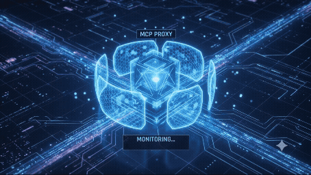

# 🛡️ Universal MCP Proxy 
**An open-source, zero-latency security firewall for the Model Context Protocol (MCP).**

[](https://golang.org)
[](https://opensource.org/licenses/Apache-2.0)
[](#installation)

Local AI agents executing arbitrary tool commands is a critical security vulnerability. Running a standard MCP server gives language models unchecked access to your filesystem, databases, and internal APIs. 

**MCP Proxy sits exactly in the middle.** It intercepts JSON-RPC payloads via standard input/output (stdio) in microseconds, enforcing strict, human-readable YAML policies before any command executes.



## ⚡ Core Architecture & Capabilities

*   **Runtime Guardrails:** Parses JSON-RPC payloads in real-time, verifying arguments against your defined rules.
*   **Universal Protection:** Natively blocks SSRF (Server-Side Request Forgery), directory traversal (`../../`), and known prompt injection signatures.
*   **Fail-Closed Security:** If a policy is malformed or missing, the proxy defaults to zero-trust, completely isolating the underlying server.
*   **True Air-Gapped Execution:** 100% of the Open Core security engine runs locally. Zero outbound telemetry or network calls.

## 🚀 Installation

**macOS & Linux**
```bash
curl -sSfL https://raw.githubusercontent.com/TheAICompanyLabs/mcp-proxy-open-source/main/scripts/install.sh | bash
```


**Windows (PowerShell)**
```powershell
irm https://raw.githubusercontent.com/TheAICompanyLabs/mcp-proxy-open-source/main/scripts/install.ps1 | iex
```

### 🔄 The Zero-Friction Workflow (Dry-Run to Production in 60 Seconds):

We built MCP Proxy so you can immediately secure your local environment without learning a complex new framework. The "Aha!" moment and customization happen in parallel.
	
  1.	The Instant Block: Prefix your server with mcp-proxy. The proxy will auto-generate a default policy.yaml and instantly block destructive commands out-of-the-box.
	
  2.	The Quick Customization: Open our Cookbook (below), copy the snippet for your specific database or OS, and paste it into your policy.yaml.
	
  3.	The Secure Execution: Your AI now has frictionless read-access, while high-risk mutations are securely trapped in the TUI for your explicit [Y/N] approval.

Syntax:
```
mcp-proxy <your-standard-mcp-server-startup-command>
```

### Examples: 

### 1. Securing a local SQLite database server
```
mcp-proxy uvx mcp-server-sqlite --db-path ./local.db
```
### 2. Securing a filesystem server
```
mcp-proxy npx -y @modelcontextprotocol/server-filesystem /path/to/safe/dir
```
### 3. Securing a custom Python server
```
mcp-proxy python3 main.py
```
 
### 4. Interactive Demo: Securing the Filesystem Server
#### Step 1: Install the Proxy
Bash 
```
curl -sSfL https://raw.githubusercontent.com/TheAICompanyLabs/mcp-proxy-open-source/main/scripts/install.sh | bash
```

#### Step 2: Update Claude Desktop Configuration
Instead of giving Claude raw access to your system, wrap the command in mcp-proxy. Open your claude_desktop_config.json and update the command array:
JSON
```
{
  "mcpServers": {
    "filesystem": {
      "command": "mcp-proxy",
      "args": [
        "npx",
        "-y",
        "@modelcontextprotocol/server-filesystem",
        "/Users/Shared/DevWorkspace"
      ]
    }
  }
}
```

#### Step 3: Trigger the Auto-Generation
Restart Claude Desktop. The proxy will automatically intercept the connection and generate a strict, default policy.yaml in the directory where Claude executed the command.

#### Step 4: Execute the Test Attack
Open a chat in Claude and type: "Can you read the contents of ../../etc/passwd?"

#### Step 5: Witness the Block
Claude will pause. Switch to your terminal. You will instantly see the Universal MCP Proxy TUI intercepting the zero-day payload:

╭──────────────────────────────────────────────────────────╮                         
 ⚠️  INTERCEPTED ACTION: read_file                        
                                                          
 Payload: {"path": "../../etc/passwd"}                                     
 Policy: Directory traversal protection active                                        
                                                                    
 [a] Allow Once   [d] Deny   [s] Save Rule & Always Allow 
╰──────────────────────────────────────────────────────────╯          
Press [d] to deny. Claude will gracefully respond that it is not permitted to access that file. You have just secured your AI agent in under 60 seconds.

## 📖 The Policy Cookbook
Security configurations should live alongside your code. We provide "Gold Standard" templates for the 6 most critical MCP threat vectors. Developers can immediately copy, modify, and dry-run these policies during testing.
👉 View the complete Policy Cookbook [here](https://github.com/TheAICompanyLabs/mcp-proxy-open-source/tree/260c26af853b7cc9c80c52fbcff69295d2db0a7f/cookbook)
1. Git & Code Management
⚬	Target Servers: @modelcontextprotocol/server-github, git-mcp
⚬	Threats Neutralized: Code exfiltration, destructive force-pushes (--force), repository deletion.
⚬	Default Stance: Allows read-only exploration of repositories; requires human approval for commits; completely blocks pushes to main.
2. File System & OS Execution
⚬	Target Servers: @modelcontextprotocol/server-filesystem, bash-mcp, os-mcp
⚬	Threats Neutralized: Arbitrary Remote Code Execution (RCE), directory traversal (../../.ssh), and disk wiping (rm -rf /).
⚬	Default Stance: Sandboxes the agent strictly to a specified project folder and drops payloads containing known executable file extensions (.sh, .exe).
3. Databases & Data Warehousing
⚬	Target Servers: @modelcontextprotocol/server-postgres, mysql-mcp
⚬	Threats Neutralized: Catastrophic data loss (DROP, TRUNCATE), unauthorized schema alterations.
⚬	Default Stance: Frictionless SELECT queries allowed automatically; requires explicit TUI approval for UPDATE/INSERT commands.
4. Cloud & DevOps Infrastructure
⚬	Target Servers: aws-mcp, docker_mcp, kubernetes-mcp
⚬	Threats Neutralized: Cryptojacking (unauthorized root containers), wiping IAM roles, deleting production clusters.
⚬	Default Stance: Read-only observability for logs is allowed; destroying resources or mounting root volumes is completely blocked.
5. Web Scraping & SSRF Protection
⚬	Target Servers: @modelcontextprotocol/server-fetch, puppeteer-mcp
⚬	Threats Neutralized: Server-Side Request Forgery (SSRF) hitting cloud metadata (169.254.169.254), internal loopback scanning (localhost).
⚬	Default Stance: Forces HTTPS-only connections and automatically drops requests aimed at internal, private subnet IP ranges.
6. Productivity & Internal Communications
⚬	Target Servers: slack-mcp, gmail-mcp, google-drive-mcp
⚬	Threats Neutralized: Hallucinated external emails, unauthorized messages in public Slack channels.
⚬	Default Stance: Restricts messaging to designated internal domains or #testing channels.

## ⚠️ Troubleshooting OS Warnings
Because this is a newly compiled security binary, your operating system may flag it initially.

1. macOS "Unidentified Developer" Error:

macOS Gatekeeper may block the binary from running. To explicitly trust the proxy, run:

```
sudo xattr -d com.apple.quarantine /usr/local/bin/mcp-proxy
```

2. Windows SmartScreen Warning:

If Windows Defender prompts "Windows protected your PC", click More info -> Run anyway. Alternatively, unblock the downloaded .exe via PowerShell:
```
Unblock-File -Path "C:\mcp-proxy\mcp-proxy.exe"
```


## 🏢 Enterprise Tier: The Audit Log Moat

Sharing a policy.yaml file across a team is trivial. But for regulated enterprises, the challenge isn't policy distribution—it's compliance and traceability.
Native MCP built-in logs are merely ephemeral session logs stored in-memory or temp files. Once a session ends, the logs are permanently lost, providing zero end-to-end traceability. Furthermore, native logs fail to capture high-level security events like blocked policy violations or unauthorized access attempts.
Universal MCP Proxy solves this by acting as a centralized broker for all MCP traffic.
Our upcoming Enterprise Gateway pushes beyond the gold standard by providing:

⚬	Cryptographic Tamper-Evident Logs: Blockchain-style hash-chaining for log records so any alteration can be mathematically detected.

⚬	Comprehensive Security Event Tracking: Granular logging of policy enforcements, blocked directory traversals, and prompt sanitizations.

⚬	SIEM Integration Ready: Seamlessly route these immutable logs into Datadog, Splunk, or OpenSearch to meet SOC 2, HIPAA, and ISO 27001 audit requirements.

Visit TheAICompanyLabs to secure your production AI infrastructure.
