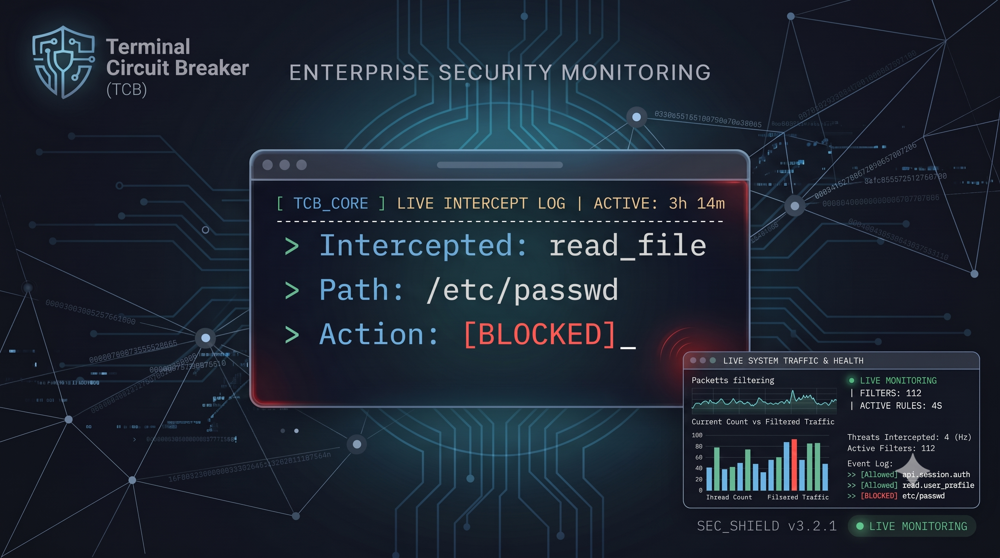

# ⚡ Terminal Circuit Breaker (for MCP)

> **A zero-latency, air-gapped consequence firewall for local AI agents.**

[](https://go.dev/)
[](LICENSE)
[](#)

<p align="center">
  
</p>

The Model Context Protocol (MCP) standardized how AI communicates with local tools. But in doing so, it inadvertently created a massive autonomous attack surface. Standard MCP proxies and enterprise gateways (like Pomerium or Entra ID) only verify *who* the user is. If an authorized agent is compromised via prompt injection, those gateways will blindly forward a destructive payload like `rm -rf /` or `DROP TABLE`.

**Terminal Circuit Breaker** solves the "Authorized Agent" blind spot. It intercepts raw JSON-RPC payloads in memory in ~15µs, evaluates the arguments against strict YAML policies, and halts dangerous executions natively in your terminal.

---

## ✨ Why This Wins (The UX Moat)

Developers abandon security tooling that breaks flow state. You shouldn't have to switch to a web browser to approve a local file read.

* **Terminal-Native Circuit Breaker:** Suspends execution immediately via a high-contrast Bubble Tea UI. Press `Y` to allow, or `N` to deny, directly in your active terminal.
* **Microsecond Interception:** Layer 1 & 2 regex and DLP rules evaluate payloads in ~15µs before they reach the target server.
* **True Air-Gapped Open Core:** 100% of the security engine runs locally. Source code and local file data never leave your workstation.
* **Auto-Scaffolding:** Dynamically generates default `REQUIRE_APPROVAL` policies the first time an unknown tool is invoked.

---

## 🚀 One-Line Installation

You don't need to be a cybersecurity expert to secure your local environment.

**macOS & Linux**
```bash
curl -sSfL https://raw.githubusercontent.com/TheAICompanyLabs/mcp-proxy-open-source/main/scripts/install.sh | bash
```

**Windows (PowerShell)**
```powershell
irm https://raw.githubusercontent.com/TheAICompanyLabs/mcp-proxy-open-source/main/scripts/install.ps1 | iex
```

---

## 🛠️ Zero-Prompt Autonomous Configuration

Achieve a secure, hands-off agent workflow in under 60 seconds.

### 1. Connect your AI Client

Terminal Circuit Breaker works universally across the MCP ecosystem. Click below for exact setup instructions for your preferred AI client:

👉 [**Integration Guide: Cursor, Claude, Windsurf, Cline, and LM Studio**](./docs/integrations.md)

### 2. Auto-Tune your Policies

When your AI client invokes a tool for the first time, a native OS popup or terminal UI will intercept it. Click **Always Allow**.

The Circuit Breaker will instantly mutate your `~/.mcp-proxy/policy.yaml` to permanently whitelist that specific tool for autonomous execution, while keeping dangerous paths (like `/etc/passwd`) strictly blocked.

---

## 🛡️ Pre-Configured Policy Cookbook

Terminal Circuit Breaker ships with drop-in, zero-trust policy templates designed for common attack vectors. Browse our audited recipes:

* 📁 [**Filesystem & OS Sandbox:**](https://github.com/TheAICompanyLabs/mcp-proxy-open-source/blob/main/cookbook/filesystem-and-os/policy.yaml) Blocks path traversal (`../../`), secret theft (`.env`, `id_rsa`), and destructive terminal commands (`rm -rf`, `sudo`).
* 🗄️ [**Database Guardrails:**](https://github.com/TheAICompanyLabs/mcp-proxy-open-source/blob/main/cookbook/database-and-data/policy.yaml) Prevents destructive SQL (`DROP`, `TRUNCATE`), unindexed mass updates, and semicolon-chained injections.
* 🌐 [**Web & SSRF Protection:**](https://github.com/TheAICompanyLabs/mcp-proxy-open-source/blob/main/cookbook/web-and-ssrf/policy.yaml) Hard-blocks cloud metadata IP exfiltration (`169.254.169.254`), private RFC 1918 subnets, and browser cookie dumps.
* 🐙 [**Git & Source Code Guard:**](https://github.com/TheAICompanyLabs/mcp-proxy-open-source/blob/main/cookbook/git-and-code/policy.yaml) Halts `--force` pushes, blocks pushes to `main`/`master`, and forbids automated repository deletion.
* ☁️ [**Cloud & DevOps Firewall:**](https://github.com/TheAICompanyLabs/mcp-proxy-open-source/blob/main/cookbook/cloud-and-devops/policy.yaml) Intercepts privileged Docker containers (`--privileged`, `-v /:`), expensive compute instances, and `terraform destroy`.
* 💬 [**Productivity & Comms:**](https://github.com/TheAICompanyLabs/mcp-proxy-open-source/blob/main/cookbook/cloud-and-devops/policy.yaml) Prevents accidental Slack broadcasts to `#general`/`@everyone` and blocks destructive calendar or Drive purging.

> 💡 **Need a universal starting point?** Copy our [Root Unified Policy](cookbook/policy.yaml) (`cookbook/policy.yaml`) directly to `~/.mcp-proxy/policy.yaml` for instant baseline coverage.

---

## 🏢 Coming Soon: Enterprise Control Plane

Managing local `.yaml` files across hundreds of developers does not scale. Our upcoming centralized Next.js control plane (**MCP Sentinel**) allows security teams to:

* Push updated `policy.yaml` rules fleet-wide.
* Aggregate centralized audit logs across thousands of developer laptops.
* Enforce cryptographic, tamper-evident log chains.

---

## 📄 License

Licensed under the [Apache 2.0 License](LICENSE).
